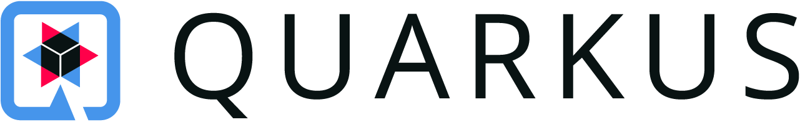

[cols="10,90",weight="80%"]
|===
|
100]
<s|{author}'s minute report - {date}
|===

== Minutes

.Topic
* Blabla.
** Blabla.
* Blabla.
** Blabla.

.Another Topic
* Blabla
** Blabla.

NOTE: This is a note.

== Asks

* Added new expenses to be approved
* PTO request : 18th of aug to 20 of Aug

== Next week

* Blabla.
** Blabla.
* Blabla.

== Tasks list

Description : List of items that needs to be addressed by the Project

[cols="^5,<65,^5,^10,^15"]
|===
| ID     | Task description                                                | Priority | Assign To | Due Date
| COD001 | Identify stakeholder(s)                                         | S        | CHM       | 16-Aug-2016
| COD002 | Approve Project/Product Code Name                               | S        | CHM       | 22-Aug-2016
| COD003 | Tools to be used to discuss/communicate                         | S        | CHM       | 22-Aug-2016
| COD004 | Review scope of the platform with Product Owner                 | S        | BGE       | 26-Aug-2016
|===
